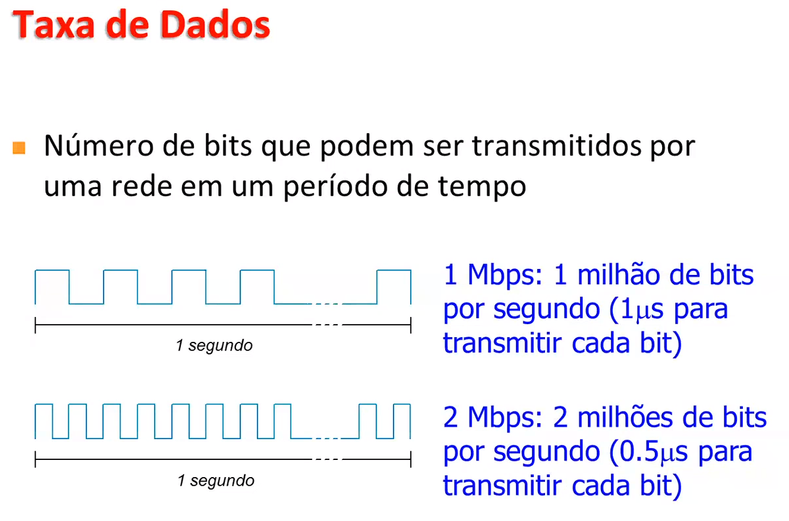

Aulas
### Camada Física
* Meios de transmissão
* Largura de banda e taxa de dados
* Unidades Métricas
* Atrasos em redes de comutação de pacotes

Oque é largura de banda?
é a faixa de frequências que aquele canal físico suporta sem grande atenuação, então ela é dada em hertz.

#### Meios de Transmissão
* Objetivo da camada física:
  * Transportar uma sequência de bits de uma máquina para outra

* Problema a ser resolvido:
    * Codificação de bits

* O tipo de meio físico a ser usado depende, dentre outros fatores de:
  * Largura de banda (bandwidth)
  * Atraso (delay) ou latência (latency) ou retardo
  * Custo
  * Facilidade de instalação e manutenção

* Os meios podem ser agrupados em:
  * Guiados: as ondas são guiadas através de um caminho físico (par trançado, cabo coaxial ou fibra óptica)
  * Não-guiados: as ondas se propagam sem haver um caminho físico (ondas de rádio, microondas ou infravermelho)

meio com fio probabilidade de erro na transmissão baixa
sem fio probabilidade de erro na transmissão mais alta

#### Largura de Banda
* É a faixa de frequência transmitida por um meio físico sem serem fortemente atenuadas, denomina-se largura de banda

* A largura de banda é uma propriedade física do meio de transmissão e, em geral, depende da construção, da espessura e do comprimento do meio

* Limitando-se a largura de banda, limita-se a taxa de dados

### Subcamada de controle de Acesso ao Meio (MAC)

#### Problema de Alocação de Canais
* Protocolos para
  * Canais difusão, ou
  * Canais de acesso múltiplo(multiacesso), ou
  * Canais de acesso aleatório
* Problema básico a ser resolvido:
  * Como "gerenciar" o acesso a canais difusão
* Protocolos responsáveis por fazer esse gerenciamento:
  * Protocolos de acesso ao meio, ou Medium Access Control (MAC)
* Sub-camada MAC está presente em quase todas as LANs

* Problema:
  * Como alocar um único canal difusão entre vários usuários?
* Duas classes de algoritmos:
  * Alocação estática
  * Alocação dinâmica

#### Alocação Estática de Canais
* FDM (***Frequency Division Multiplexing***)
  * Se existem N usuários, a largura de banda é dividida em N partes do mesmo tamanho e a cada usuário será atribuída uma parte
* FDM é a forma tradicional quando:
  * Existe um número pequeno e fixo de usuários
  * Cada um possui um tráfego pesado
* Outro cenário:
  * Grande número de estações
  * Esse número varia ao longo do tempo
  * Tráfego é em rajadas
* Normalmente, FDM não é a solução:
  * Sub-canais ficam ociosos quando não há nada a transmitir
  * Em sistemas de computação, o tráfego é tipicamente em rajadas

#### Alocação Dinâmica de Canais
* Estações:
  * Existem N estações independentes que geram quadros a serem transmitidos
  * A estação fica bloqueada até o quadro ser totalmente transmitido
* Único canal de comunicação:
  * Todas estações compartilham um único canal de comunicação para transmissão e recepção
  * Do ponto de vista de hardware, as estações são equivalentes
  * Do ponto de vista de software, as estações podem ter prioridades
* Colisões:
  * A transmissão "simultânea" de dois ou mais quadros por estações diferentes causa uma colisão
  * Estações são capazes de detectar colisões
  * Quadros envolvidos em colisões devem ser transmitidos mais tarde
* Política de transmissão de quadros ao longo do tempo:
  * Tempo contínuo (continuous time): qualquer instante
  * Tempo segmentado (slotted time): o tempo é dividido em intervalos discretos(slots), as transmissões de quadros sempre começam no início de um slot
