## **Acrônimos:**
* VPNs (Virtual Private Networks)
* NFC (Near Field Communication)
* RFID (Radio Frequency IDentification)
* LAN (Local Area Network)
* AP (Access Point)
* MAN (Metropolitan Area Network)
* WAN (Wide Area Network)
* ISP (Internet Service Provider)
* ISO (International Standards Organization)
* OSI (Open Systems Interconnection)
* IP  (Internet Protocol)
* TCP (Trnasmission Control Protocol)
* UDP (User Datagram Protocol)
* ICMP(Internet Control Message Protocol)
* DNS (Domain Name Service)
* FTTH (Fiber to the home)
* CSMA (Carrier Sense Multiple Access)

# Termos importantes
#### Peer-to-peer(do inglês par-a-par ou ponto-a-ponto, famoso P2P)
é uma arquitetura de redes de computadores onde cada um dos pontos ou nós da rede funciona tanto como cliente quanto como servidor, permitindo compartilhamentos de serviços e dados sem a necessidade de um servidor central.
Seu projeto tem como objetivo distribuir um serviço totalmente descentralizado e organizado, equilibrando, automaticamente, as cargas de armazenamento e processamento de forma dinâmica entre todos os computadores participantes à medida que as máquinas entram e saem do serviço.

# Tópicos do livro
## HARDWARE DE REDE
redes de computadores hoje que se destacam além das demais: a tecnologia de transmissão e a escala.
#### Tecnologias de transmissão
Em termos gerais, há dois tipos de tecnologias de transmissão em uso disseminado nos dias de hoje: enlaces de **broadcast** e enlaces **ponto a ponto**.

Os enlaces ponto a ponto conectam pares de máquinas individuais. Para ir da origem ao destino em uma rede composta de enlaces ponto a ponto, mensagens curtas, chamadas **pacotes** em certos contextos, talvez tenham de visitar primeiro uma ou mais máquinas intermediárias.
A transmissão ponto a ponto com exatamente um transmissor e exatamente um receptor às vezes é chamada de **unicasting**.

Já as redes de broadcast tem apenas um canal de comunicação, compartilhado por todas as máquinas da rede; os pacotes enviados por qualquer máquina são recebidos por todas as outras.

**Obs:** *Uma rede sem fio é um exemplo comum de um enlace broadcast, com a comunicação compartilhada por uma região de cobertura que depende do canal sem fios e da máquina transmissora.*

##### Escala ou escalabilidade
Um critério alternativo para classificar as redes. A distância é importante como métrica de classificação, pois diferentes tecnologias são usadas em diferentes escalas.

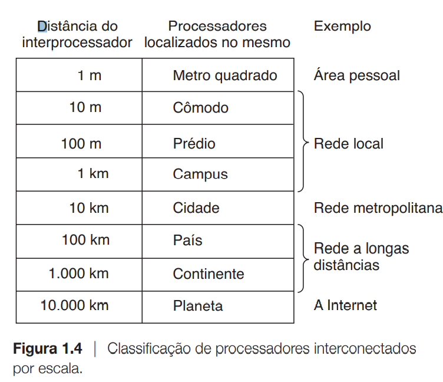

#### Redes Pessoais
As redes pessoais, ou PANs (Personal Area Networks), permitem que dispositivos se comuniquem pelo
alcance de uma pessoa.

**Bluetooth** as redes Bluetooth usam um paradigma mestre-escravo.

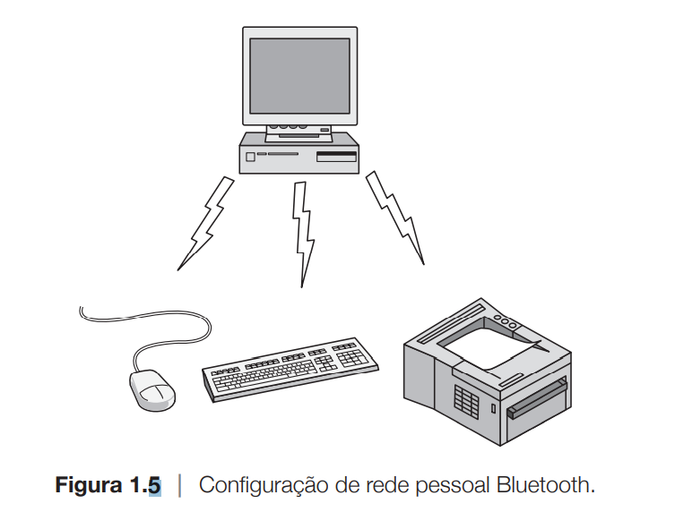

A unidade do sistema(PC) normalmente é o mestre, e os periféricos, escravos. O mestre diz aos escravos quais endereços usar, quando eles podem transmitir, por quanto tempo, quais frequências eles podem usar e assim por diante.

#### Redes Locais
**Rede local**, ou **LAN(Local Area Network).** Uma LAN é uma rede particular que opera dentro e próximo de um único prédio, como uma residência, um escritório ou uma fábrica. As LANs são muito usadas para conectar computadores pessoais e aparelhos eletrônicos, para permitir que compartilhem recursos (como impressoras) e troquem informações.

 **obs**: Quando as LANs são usadas pelas empresas, elas são chamadas **redes empresariais.**
  LANs sem fio são muito populares atualmente, especialmente nas residências, prédios de escritórios antigos e lugares onde a instalção de cabos é muito trabalhosa. Nesses sistemas, cada computador tem um rádio modem e uma antena, que ele usa para se comunicar com outros computadores. Quase sempre, cada computador fala com um dispositivo no teto, chamado **ponto de acesso**, **roteador sem fio** ou **estação-base**,repassa os pacotes entre os computadores sem fio e também entre eles e a Internet. Ser o AP é como ser o garoto popular na escola, pois todos querem falar com você. Porém, se os outros computadores estiverem próximos o suficiente, eles podem se comunicar diretamente em uma configuração peer-to-peer.
  Existe um padrão para as LANs sem fios, chamado **IEEE 802.11**, nosso famigerado **WiFi**. Ele trabalha em velocidades de 11 a centenas de Mbps.

 As LANs com fios Utilizam uma série de tecnologias de transmissão diferentes. A maioria delas usa fios de cobre, mas algumas usam fibra óptica. A topologia de muitas LANs com fios é embutida a partir de enlaces ponto a ponto. O IEEE 802.3, popularmente chamado **Ethernet**, é de longe o tipo mais comum de LAN com fios.

 **Ethernet comutada**

 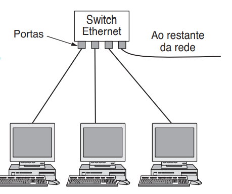

 Cada computador troca informações usando o protocolo Ethernet e se conecta a um dispositivo de rede chamado **switch**, com um enlace ponto a ponto. Daí o nome. Um switch tem várias **portas**, cada qual podendo se conectar a um computador. A função do switch é repassar os pacotes entre os computadores que estão conectados a ela, usando o endereço em cada pacote para determinar para qual computador enviá-lo.
 Os switches podem ser conectados uns aos outros usando suas portas. Também é possível dividir uma LAN física grande em duas LANs lógicas menores(VLAN).

 As redes de broadcast, com e sem fios, ainda podem ser divididas em estáticas e dinâmicas, dependendo do modo como o canal é alocado. Em uma alocação estática típica, o tempo seria dividido em intervalos discretos e seria utilizado um algoritmo de rodízio, fazendo com que cada máquina transmitisse apenas no intervalo de que dispõe. Mas a maioria dos sistemas procura alocar o canal dinamicamente(por demanda) pois não compensa ficar esperando...

 Os métodos de alocação dinâmica de um canal comum são centralizados ou descentralizados. No método centralizado de alocação de canal, existe apenas uma entidade, por exemplo, a estação-base nas redes celulares, que determina quem transmitirá em seguida. No método descentralizado de alocação de canal, não existe nenhuma entidade central; cada máquina deve decidir por si mesma se a transmissão deve ser realizada. Da a ideia de que isso sempre leva ao caos, mas isso não acontece. Depois estudaremos algoritmos criados para impedir a instauração do caos potencial.

#### Redes Metropolitanas
Uma **rede metropolitana**, ou **MAN (Metropolitan Area Network), abrange uma cidade. O exemplo mais conhecido de MANs é a rede de televisão a cabo disponível em muitas cidades. Em uma primeira aproximação, uma MAN seria semelhante ao sistema mostrado abaixo:
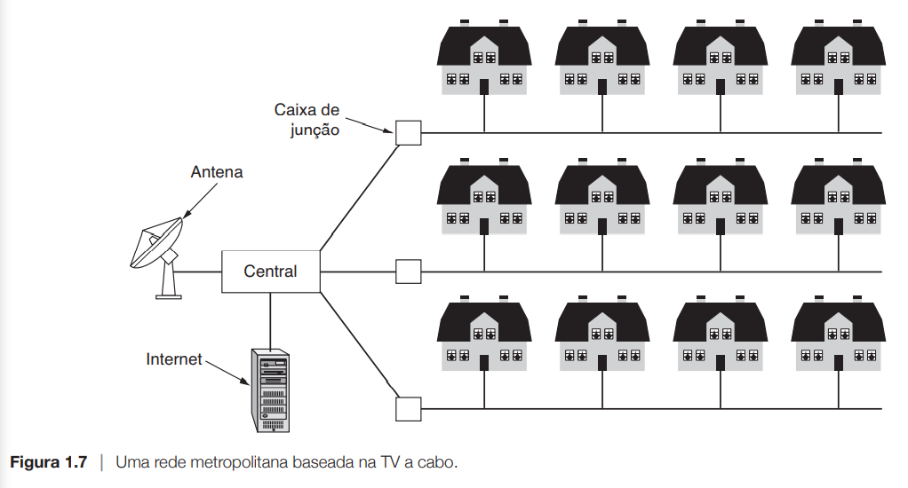
observamos que os sinais de televisão e de internet são transmitidos à **central a cabo** centralizada para distribuição subsequente  às casas das pessoas. Porém, a televisão a cabo não é a única MAN. OS desenvolvimentos recentes para acesso à internet de alta velocidade sem fio resultaram em outra MAN, que foi padronizada como IEEE 802.16 e é conhecida popularmente como **WiMax.**

#### Redes A Longas Distâncias
Uma **rede a longa distância**, ou **WAN (Wide Area Network)**, abrange uma grande área geográfica, com frequência um país ou continente. Na maioria das WANs, a sub-rede consiste em dois componentes distintos: linhas de transmissão e elementos de comutação. As **linhas de transmissão** transportam bits entre as máquinas. Elas podem ser formadas por fios de cobre, fibra óptica, ou mesmo enlaces de radiofusão. Os **elementos de comutação**, ou apenas comutadores, são computadores especializados que conectam três ou mais linhas de transmissão. Quando os dados chegam a uma interface de entrada, o elemento de comutação deve escolher uma interface de saída para encaminhá-los. Esses computadores de comutação receberam diversos nomes no passado; o nome **roteador** é, agora o mais comumente usado.
Obs: 'sub-rede'. Originalmente, seu **único** significado identificava o conjunto de roteadores e linhas de comunicação que transportava pacotes entre os hosts de origem e de destino.

##### Variedade de WANs
Primeiro , em vez de alugar linhas de transmissão dedicadas, uma empresa pode conectar seus escritórios à Internet. Isso permite que as conexões sejam feitas entre os escritórios como enlaces virturais que usam a capacidade de infraestrutura da Internet. Esse arranjo:
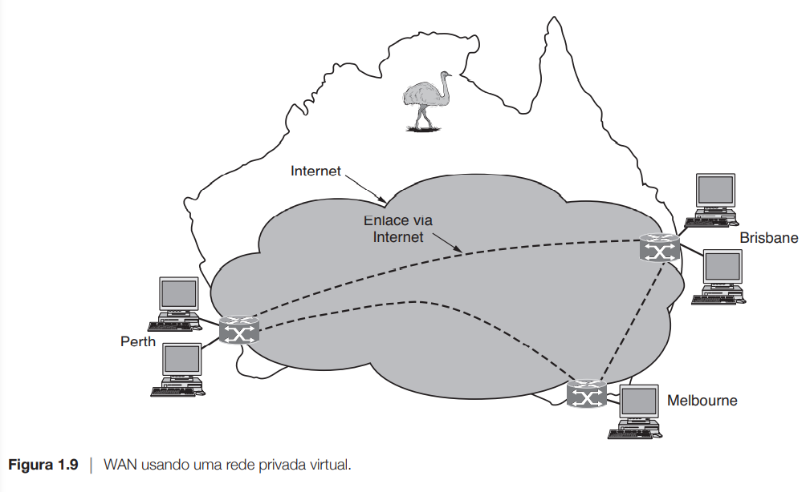
é chamado de **rede privada virtual,** ou **VPN (Virtual Private Network)**. Em comparação com o arranjo dedicado, uma VPN tem a vantagem comum da virtualização, ou seja, ela oferece flexibilidade na reutilização de recurso (conectividade com a Internet). Com uma VPN, suas milhas estão sujeitas à variação, de acordo com o serviço da internet.
A segunda variação é que a sub-rede pode ser operada por uma empresa diferente. O operador da sub-rede é conhecido como um **provedor de serviço de rede**, e os escritórios são seus clientes. O operador da sub-rede também se conectará a outros clientes, desde que eles possam pagar e ela possa oferecer o serviço. O operador da sub-rede também se conectará a outras redes que fazem parte da Internet. Esse operador de sub-rede é chamado de **provedor de serviço de Internet,** ou **ISP (Internet Service Provider),** e a sub-red é uma **rede ISP.** Seus clientes que se conectam à ISP recebem serviço de internet. A rede de telefonia celular é outro exemplo de uma WAN que usa tecnologia sem fio. Esse sistema já passou por três gerações, e uma quarta está a caminho. A primeira geração era analógica e usada apenas para voz e usada apenas para voz. a segunda geração era digital e apenas para voz. A terceira geração é digital e se destina a voz e dados.

#### Redes Interligadas (Internets)
Existem muitas redes no mundo, frequentemente apresentando diferentes tipos de hardware e software. normalmente, as pessoas conectadas a redes distintas precisam se comunicar entre si. Para que esse desejo se torne uma realidade, é preciso que se estabeleçam conexões entre redes quase sempre incompatíveis. Um conjunto de redes interconectadas forma uma **rede interligada** ou **internet**. O nome geral para uma máquina que faz uma conexão entre duas ou mais redes e oferece a conversão necessária, tanto em termos de hardware quanto de software, é um **gateway.** Os gateways são distinguidos pela camada em que operam na hierarquias de protocolos. Como o benefício de formar uma rede interligada é conectar computadores pelas redes, não queremos usar um gateway em muito baixo nível, ou então não poderemos fazer conexões entre diferentes tipos de redes. Também não queremos usar um gateway em um nível muito alto, ou então a conexão só funcionará para determinadas aplicações. O nível do meio, que é o mais apropriado, normalmente é chamado de camada de rede, e um roteador é um gateway que comuta pacotes nessa camada. Agora podemos localizar uma rede interligada descobrindo uma rede que tem roteadores.

#### Software De Rede

##### Hierarquias De Protocolos
Para reduzir a complexidade de seu projeto, a maioria das redes é organizada como uma pilha de **camadas**(ou **níveis**), colocadas umas sobre as outras. O número, o nome, o conteúdo e a função de cada camada diferem de uma rede para outra. No entanto, em todas as redes o objetivo de cada camada é oferecer determinados serviços às camadas superiores, isolando essas camadas dos detalhes de implementação real desses recursos. Em certo sentido, cada camada é uma espécie de máquina virtual, oferecendo determinados serviços à camada situada acima dela.

Quando a camada n de uma máquina se comunica com a camada n de outra máquina, coletivamente, as regras e convenções usadas nesse diálogo são conhecidas como protocolo da camada n. Basicamente, um **protocolo** é um acordo entre as partes que se comunicam, estabelecendo como se dará a comunicação.
Rede de cinco camadas:
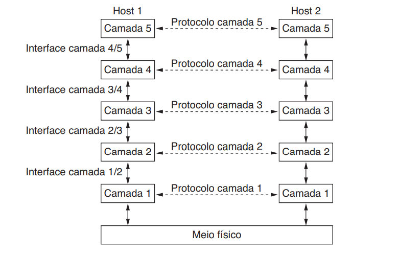
As entidade que ocupam as camadas correspondentes em diferentes máquinas são chamadas pares(ou **peers**). Os pares podem ser processos de software, dispositivos de hardware, ou mesmo seres humanos. Em outras palavras, são os pares que se comunicam utilizando o protocolo. Não há comunicação direta entre a camada n de uma máquina para camada n de outra máquina. Em vez disso, cada camada transfere os dados e as informações de controle para a camada imediatamente abaixo dela, até a camada mais baixa ser alcançada, abaixo da camada 1 encontra-se o **meio físico** por meio do qual se dá a comunicação propriamente dita. Entre cada par de camadas adjacentes existe uma **interface**. Esta define as operações e os serviços que a camada inferior tem a oferecer à camada acima dela.

Um conjunto de camadas e protocolos é chamado de **arquitetura de rede**. A especificação de uma arquitetura deve conter informações suficientes para permitir que um implementador desenvolva o programa ou construa o hardware de cada camada de forma que ela obedeça corretamente ao protocolo adequado. Uma lista de protocolos usados por um determinado sistema, um protocolo por camada, é chamada **pilha de protocolos.**

##### Questões de projeto relacionadas às camadas
Confiabilidade é a questão de projeto de criar uma rede que opere corretamente, embora sendo composta de uma coleção de componentes que não são confiáveis. Imaginando bits de um pacote trafegando pela rede. Há uma chance de que alguns desses bits sejam recebidos com problemas(invertidos) em virtude de um ruído elétrico casual, sinais sem fio aleatórios, falhas de hardware, bugs de software e assim por diante.

Uma segunda questão de projeto se refere à evolução da rede. Com o tempo, as redes se tornam maiores e novos projetos aparecem precisando ser conectados à rede existente. Recentemente, vimos o mecanismo-chave de estrutura usado para dar suporte à mudança, dividindo o problema geral e ocultando detalhes da implementação: as **camadas de protocolos.** Mas existem outras estratégias.

Uma terceira questão de projeto é a alocação de recursos. As redes oferecem um serviço aos hosts a partir de
seus recursos subjacentes, como a capacidade de linhas de
transmissão. Para fazer isso bem, elas precisam de mecanismos que dividem seus recursos de modo que um host não
interfira muito em outro.

A última questão de projeto trata de proteger a rede, defendendo-a contra diferentes tipos de ameaças. Uma das ameaças que mencionamos anteriormente é a de bisbilhotagem nas comunicações. Mecanismos que oferecem **confidencialidade** defendem contra essa ameaça e são usados em várias camadas. Os mecanismos para **autenticação** impedem que alguém finja ser outra pessoa.

##### Serviços orientados e não orientados a conexões
O serviço **orientado a conexões** se baseia no sistema telefônico. Para falar com alguém, você tira o fone do gancho, digita o número, fala e, em seguida, desliga. Da mesma forma, para utilizar um serviço de rede orientado a conexões, primeiro o usuário do serviço estabelece uma conexão, a utiliza, e depois a libera.
Em alguns casos, quando uma conexão é estabelecida, o transmissor, o receptor e a sub-rede conduzem uma negociação sobre os parâmetros a serem usados, como o tamanho máximo das mensagens, a qualidade do serviço exigida e outras questões.

Ao contrário do serviço orientado a conexões, o serviço **não orientado a conexões** se baseia no sistema postal. Cada mensagem(carta) carrega o endereço de destino completo e cada uma delas é roteada pelos nós intermediários através do sistema, independentemente de todas as outras. Existem diferentes nomes para mensagens em diferentes contextos; um **pacote** é uma mensagem na camada de rede. Quando os nós intermediários recebem uma mensagem completa antes de enviá-la para o próximo nó, isso é chamado **comutação store-and-forward.** A alternativa, em que a transmissão de uma mensagem em um nó começa antes de ser completamente recebida por ele é chamada **comutação cut-through.**

Cada tipo de serviço pode ser caracterizado por sua confiabilidade. Em geral, um serviço confiável é implementado para que o receptor confirme o recebimento de cada mensagem, de modo que o transmissor se
certifique de que ela chegou.
Para algumas aplicações, os atrasos introduzidos pelas confirmações são inaceitáveis. Uma dessas aplicações é o tráfego de voz digital por **Voice over IP (VoIP).** Os usuários de telefone preferem ouvir um pouco de ruído na linha ou uma palavra truncada de vez em quando a experimentar um atraso para aguardar confirmações.

O serviço não orientado a conexões não confiável (ou seja, sem confirmação) costuma ser chamado serviço de **datagramas**, em uma analogia com o serviço de telegramas, que também não oferece uma confirmação ao transmissor.

Em outras situações, a conveniência de não ter de estabelecer uma conexão para enviar uma única mensagem curta é desejável, mas a confiabilidade é essencial. O serviço de **datagramas confirmados** pode ser oferecido para essas aplicações. Ele é semelhante a enviar uma carta registrada e solicitar um aviso de recebimento. Quando o aviso é devolvido, o transmissor fica absolutamente certo de que a carta foi entregue ao destinatário e não perdida ao longo do caminho.(tipo o zap zap)

Outro serviço é o de **solicitação/resposta.** Nele, o transmissor envia um único datagrama contendo uma solicitação; a resposta contém a réplica. A solicitação/resposta é em geral usada para implementar a comunicação no modelo cliente-servidor: o cliente emite uma solicitação e o servidor responde.

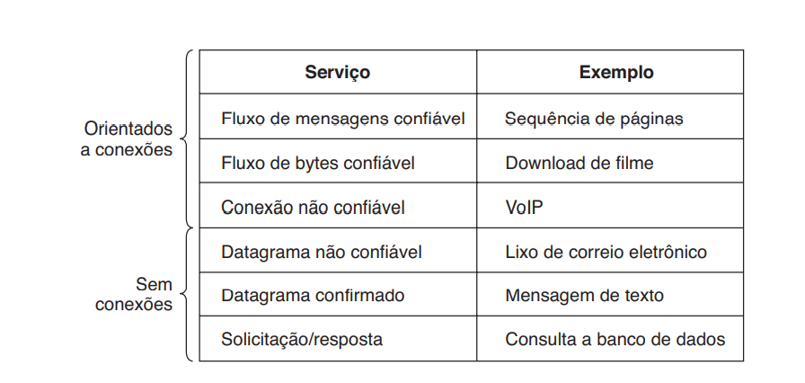

##### Primitivas De Serviço
Um serviço é especificado formalmente por uma conjunto de **primitivas** (operações) disponíveis para que os processos do usuários acessem o serviço. Essas primitivas informam ao serviço que ele deve executar alguma ação ou relatar uma ação executada por uma entidade par. Se a pilha de protocolos estiver localizada no sistema operacional, como ocorre com frequência, as primitivas serão normalmente chamadas do sistema. Essas chamadas geram uma armadilha para o kernel, que então devolve o controle da máquina ao sistema operacional para enviar os pacotes necessários.

##### Relacionamento Entre Serviços E Protocolos
Serviços e protocolos são conceitos diferentes. Um serviço é um conjunto de primitivas (operações) que uma camada oferece à camada situada acima dela. O serviço define as operações que a camada está preparada para executar em nome de seus usuários, mas não informa absolutamente nada sobre como essas operações são implementadas. Um serviço se relaciona a uma interface entre duas camadas, sendo a camada inferior o fornecedor do serviço e a camada superior, o usuário do serviço.

Ao contrário, o protocolo é um conjunto de regras que controla o formato e o significado dos pacotes ou mensagens que são trocadas pelas entidades pares contidas em uma camada. As entidades utilizam protocolos com a finalidade de implementar suas definições de serviço. Elas têm a liberdade de trocar seus protocolos, desde que não alterem o serviço visível para seus usuários. Portanto, o serviço e o protocolo são independentes um do outro.
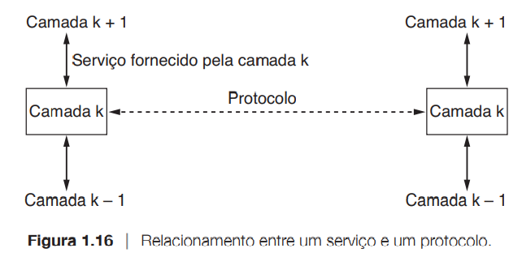

#### Modelos De Referência
Modelos de referência a se tratar, OSI e TCP/IP. Embora os protocolos associados ao modelo OSI raramente sejam usados nos dias de hoje, o modelo em si é de fato bastante geral e ainda válido, e as características descritas em cada camada ainda são muito importantes. O modelo TCP/IP tem características opostas: o modelo propriamente dito não é muito utilizado, mas os protocolos são bastante utilizados.

##### O Modelo De Referência OSI
Esse modelo se baseia em uma proposta desenvolvida pela ISO (International Standards Organization) como um primeiro passo em direção à padronização internacional dos protocolos usados nas várias camadas (Day e Zimmermann, 1983). Ele foi revisado em 1995. O modelo se chama **Modelo de Referência ISO OSI (Open Systems Interconnection),** pois ele trata da interconexão de sistemas abertos - ou seja, sistemas abertos à comunicação com outros sistemas. Para abreviar chamaremos de **modelo OSI**.

O modelo OSI tem sete camadas. Veja, a seguir, um resumo dos princípios aplicados para chegar às sete camadas.
1. Uma camada deve ser criada onde houver necessidade de outro grau de abstração.
2. Cada camada deve executar uma função bem definida.
3. A função de cada camada deve ser escolhida tendo em vista a definição de protocolos padronizados internacionalmente.
4. Os limites de camadas devem ser escolhidos para minimizar o fluxo de informações pelas interfaces.
5. O número de camadas deve ser grande o bastante para que funções distintas não precisem ser desnecessariamente colocadas na mesma camada e pequeno o suficiente para que a arquitetura não se torne difícil de controlar.

**A Camada Física**

A **camada física** trata da transmissão de bits normais por um canal de comunicação. O projeto da rede deve garantir que, quando um lado enviar um bit 1, o outro lado o receberá como um bit 1, não como um bit 0. As questões mais comuns aqui são quais o sinais elétricos que devem ser usados para representar um bit 1 e um bit 0, que quantidade de nanossegundos que um bit deve durar, se a transmissão pode ou não ser realizada simultaneamente nos dois sentidos, a forma como a conexão inicial será estabelecida e de que maneira ela será encerrada quando ambos os lados tiverem terminado, e ainda quantos pinos o conector de rede terá e qual será a finalidade de cada pino. Nessa situação, as questões de projeto lidam em grande parte com interfaces mecânicas, elétricas e de sincronização, e com o meio físico de transmissão que se situa abaixo da camada física.

**A Camada De Enlaces De Dados**

A principal tarefa da **camada de enlace de dados** é transformar um canal de transmissão normal em uma linha que pareça livre de erros de transmissão. Para fazer isso, a camada de enlace mascara os erros reais, de modo que a camada de rede não os veja. Isso é executado fazendo com que o transmissor divida os dados de entrada em **quadros de dados** (que, em geral, têm algumas centenas ou alguns milhares de bytes) e transmita os quadros sequencialmente. Se o serviço for confiável, o receptor confirmará a recepção correta de cada quadro, enviando de volta um **quadro de confirmação.**

As redes de broadcast têm uma questão adicional a ser resolvida na camada de enlace de dados: como controlar o acesso ao canal compartilhado. Uma subcamada especial da camada de enlace de dados, a subcamada de **controle de acesso ao meio**, trata desse problema.

**A Camada De Rede**

A **camada de rede** controla a operação da sub-rede. Uma questão fundamental de projeto é determinar a maneira como os pacotes são roteados da origem até o destino. As rotas podem se basear em tabelas estáticas, 'amaradas' à rede e raramente alteradas, ou frequentemente podem ser atualizadas de forma automática, para evitar componentes defeituosos. Elas também podem ser determinadas no início de cada conversação; por exemplo, uma sessão de terminal, como um login em uma máquina remota. Por fim, elas podem ser altamente dinâmicas, sendo determinadas para cada pacote, refletindo a carga atual da rede. De modo mais geral, a qualidade do serviço fornecido (atraso, tempo em trânsito, instabilidade etc.) também é uma questão da camada de rede.

Quando um pacote precisa trafegar de uma rede para outra até chegar a seu destino, podem surgir muitos problemas. O endereçamento utilizado pela segunda rede pode ser diferente do que é usado pela primeira. Talvez a segunda rede não aceite o pacote por ele ser muito grande. Os protocolos podem ser diferentes e assim por diante. Cabe à camada de rede superar todos esses problemas, a fim de permitir que redes heterogêneas sejam interconectadas.
Nas redes de broadcast, o problema de roteamento é simples e, assim, a camada de rede geralmente é estreita, ou mesmo inexistente.

**A Camada De Transporte**

A função básica da camada de transporte é aceitar dados da camada acima dela, dividi-los em unidades menores, se for preciso, repassar essas unidades à camada de rede e garantir que todos os fragmentos chegarão corretamente à outra extremidade.
A camada de transporte também determina que tipo de serviço deve ser fornecido à camada de sessão e, por fim, aos usuários da rede. O tipo mais popular de conexão de transporte é um canal ponto a ponto livre de erros que entrega mensagens ou bytes na ordem em que eles foram enviados. O tipo de serviço é determinado quando a conexão é estabelecida. A camada de transporte é uma verdadeira camada de ponta a ponta, que liga origem ao destino. Em outras palavras, um programa na máquina de origem mantém uma conversação com um programa semelhante instalado na máquina destino, utilizando os cabeçalhos de mensagens e as mensagens de controle.
A camada de transporte é uma verdadeira camada de ponta a ponta, que liga a origem ao destino.

**A Camada De Sessão**

A camada de sessão permite que os usuários em diferentes máquinas estabeleçam **sessões de comunicação** entre eles. Uma sessão oferece diversos serviços, inclusive o **controle de diálogo** (mantendo o controle de quem deve transmitir em cada momento), o **gerenciamento de tokens** (impedindo que duas partes tentem executar a mesma operação crítica ao mesmo tempo) e a **sincronização** (realizando a verificação periódica de longas transmissões para permitir que elas continuem a partir do ponto em que estavam ao ocorrer uma falha e a subsequente recuperação).

**A Camada De Apresentação**

A **camada de apresentação** está relacionada à sintaxe e à semântica das informações transmitidas. Para tornar possível a comunicação entre computadores com diferentes representações internas dos dados, as estruturas de dados a serem trocadas podem ser definidas de maneira abstrata, com uma codificação padrão que será usada durante a conexão. A camada de apresentação gerencia essas estruturas de dados abstratas e permite a definição e o intercâmbio de estruturas de dados de nível mais alto (por exemplo, registros bancários).

**A Camada De Aplicação**

A camada de aplicação contém uma série de protocolos comumente necessários para os usuários. Um protocolo de aplicação amplamente utilizado é o **HTTP (HyperText Transfer Protocol)**, que constitui a base da World Wide Web. Quando um navegador deseja uma página Web, ele envia o nome da página desejada ao servidor que hospeda a página, utilizando o HTTP. O servidor, então, transmite a página ao navegador. Outros protocolos de aplicação são usados para transferência de arquivos, correio eletrônico e transmissão de notícias pela rede.

##### O Modelo De Referência TCP/IP

Modelo de referência usado na 'avó' de todas as redes de computadores a longa distância, a ARPANET, e sua sucessora, a Internet mundial. Essa arquitetura posteriormente ficou conhecida como **modelo de referência TCP/IP**, graças a seus dois principais protocolos.
Uma rede de comutação de pacotes baseada em uma camada de interligação de redes com serviço não orientado a conexões, passando por diferentes topologias de redes.

**A Camada De Enlace**

A **camada de enlace**, a mais baixa no modelo, descreve o que os enlaces como linhas seriais e a Ethernet clássica precisam fazer para cumprir os requisitos dessa camada de interconexão com serviço não orientado a conexões. Ela não é uma camada propriamente dita, no sentido normal do termo, mas uma interface entre os hosts e os enlaces de transmissão.

**A Camada Internet (Camada De Rede)**

A **camada internet** integra toda a arquitetura, mantendo-a unida. Sua tarefa é permitir que os hosts injetem pacotes em qualquer rede e garantir que eles trafegarão independentemente até o destino (talvez em uma rede diferente). Eles podem chegar até mesmo em uma ordem diferente daquela em que foram enviados, obrigando as camadas superiores a reorganizá-los, caso a entrega em ordem seja desejável.

A camada internet define um formato de pacote oficial e um protocolo chamado **IP (Internet Protocol)**, mais um protocolo que o acompanha, chamado ICMP (**Internet Control Message Protocol**). A tarefa da camada internet é entregar pacotes IP onde eles são necessários.

**A Camada De Transporte**

No modelo TCP/IP, a camada localizada acima da camada internet agora é chamada **camada de transporte.** A finalidade dessa camada é permitir que as entidades pares dos hosts de origem e de destino mantenham uma conversação. Dois protocolos de ponta a ponta foram definidos aqui. O primeiro deles, o protocolo de controle de transmissão, ou TCP (Transmission Control Protocol), é um protocolo orientado a conexões confiável que permite a entrega sem erros de um fluxo de bytes originário de uma determinada máquina em qualquer computador da internet. Esse protocolo fragmenta o fluxo de bytes de entrada em mensagens discretas e passa cada uma delas para a camada internet. No destino, o processo TCP receptor volta a montar as mensagens recebidas no fluxo de saída. O TCP também cuida do controle de fluxo, impedindo que um transmissor rápido sobrecarregue um receptor lento com um volume de mensagens maior do que ele pode manipular.

O segundo protocolo nessa camada, o protocolo de datagrama do usuário, ou **UDP (User Datagram Protocol),** é um protocolo sem conexões, não confiável, para aplicações que não desejam a sequência ou o controle de fluxo do TCP, e que desejam oferecer seu próprio controle. Ele é muito usado para consultas isoladas, com solicitação e resposta, tipo cliente-servidor, e aplicações em que a entrega imediata é mais importante do que a entrega precisa, como na transmissão de voz ou vídeo.

**A Camada De Aplicação**

O modelo TCP/IP não tem as camadas de sessão ou de apresentação. Não foi percebida qualquer necessidade para elas. Ao invés disso, as aplicações simplesmente incluem quaisquer funções e apresentação que forem necessárias.

Acima da camada de transporte, encontramos a **camada de aplicação.** Ela contém todos os protocolos de nível mais alto. Dentre eles estão o protocolo de terminal virtua (TELNET), o protocolo de transferência de arquivos (FTP) e o protocolo de correio eletrônico (SMTP). Muitos outros protocolos foram incluídos no decorrer dos anos. Alguns dos mais importantes, incluem o DNS (Domain Name Service), que mapeia os nomes de hosts para seus respectivos endereços da camada de rede (Internet), o HTTP, protocolo usado para buscar páginas na World Wide Web, e o RTP, protocolo para entregar mídia em tempo real, como voz ou vídeo.

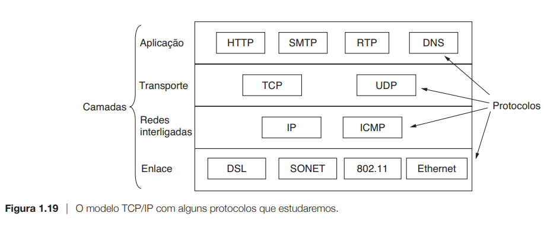

#### Exemplos De Redes

##### A Internet
A internet não é de modo algum uma rede, mas sim um vasto conjunto de redes diferentes que utilizam certos protocolos comuns e fornecem determinados serviços comuns. É um sistema incomum no sentido de não ter sido planejado nem ser controlado por ninguém.

**A ARPANET**

A história começa no final da década de 1950. No auge da Guerra Fria, o Departamento de Defesa dos Estados Unidos queria uma rede de controle e comando capaz de sobreviver a uma guerra nuclear. Nessa época, toda as comunicações militares passavam pela rede de telefonia pública, considerada vulnerável.
Foi sugerido por Wesley Clark, a criação de uma sub-rede comutada por pacotes, dando a cada host seu próprio roteador. A sub-rede consistiria em minicomputadores chamados processadores de mensagens de interface, ou **IMPs(Interface Message Processors)**, conectados por linhas de transmissão de 56 kbps. Para garantir sua alta confiabilidade, cada IMP seria conectado a pelo menos dois outros IMPs. A sub-rede tinha de ser uma sub-rede de datagrama, de modo que, se algumas linhas e alguns IMPs fossem destruídos, as mensagens poderiam ser roteadas automaticamente para caminhos alternativos.
Cada nó da rede deveria ter um IMP e um host na mesma sala, conectados por um fio curto. Um host poderia enviar mensagens de até 8.063 bits para seu IMP que, em seguida, dividiria essas mensagens em pacotes de no máximo 1.008 bits e os encaminharia de forma independente até o destino. Cada pacote era recebido por completo antes de ser encaminhado; assim, a sub-rede se tornou a primeira rede eletrônica de comutação de pacotes de store-and-forward (de armazenamento e encaminhamento). BBN, empresa que ficará encarregada da contrução da sub-rede. A BBN resolveu utilizar, como IMPs, minicomputadores Honeywell DDP-316 especialmente modificados, com 12k palavras de 16 bits de memória principal. Os IMPs não tinham unidades de discos, pois os componentes móveis eram considerados pouco confiáveis .Os IMPs eram interconectados por linhas privadas das companhias telefônicas, de 56 kbs.
O software foi dividido em duas partes: sub-rede e host. O software da sub-rede consistia na extremidade IMP da conexão host-IMP, no protocolo IMP-IMP e em um protocolo do IMP de origem para o IMP de destino, criado para aumentar a confiabilidade.

O TCP/IP  foi criado especificamente para manipular a comunicação entre redes interligadas, algo que se tornou mais importante à medida que um número maior de redes era conectado à ARPANET. Os pesquisadores na University of California em Berkeley reescreveram o TCP/IP com uma nova interface de programação **(soquetes)** para o lançamento iminente da versão 4.2BSD do UNIX de Berkeley.

Durante a década de 1980, novas redes, em particular as LANs, foram conectadas à ARPANET. À medida que a escala aumentou, tornou-se cada vez mais dispendioso localizar os hosts, e assim foi criado o sistema de nomes de domínio, ou **DNS** (**Domain Name System**), para  organizar máquinas em domínios e relacionar nomes de hosts com endereços IP. Desde então, o DNS se transformou em um sistema generalizado de bancos de dados distribuídos, capaz de armazenar uma série de informações referentes à atribuição de nomes.

**NSFNET**
A National Science Foundation Network foi um programa de financiamento da internet, patrocinado pela National Science Foundation entre 1985 e 1995, para promover uma rede de educação e pesquisa nos Estados Unidos. Também é nome dos primeiros backbones existentes da internet.
Para ter algo concreto com que começar, a NSF decidiu construir uma rede de backbone para conectar seus seis centros de supercomputadores. Cada supercomputador ganhou um irmão mais novo, um micro computador LSI-11, chamado **fuzzball**. Os fuzzballs estavam conectados a linhas privadas de 56 kbps e formavam a sub-rede, usando a mesma tecnologia de hardware da ARPANET. Porém, a tecnologia de software era diferente: os fuzzballs se comunicavam diretamente com o tcp/ip desde o início, criando, assim, a primeira WAN TCP/IP.
Ela se conectava à ARPANET por meio de um link entre um IMP e um fuzzball na central de processamento de dados da Carnegie-Mellon.

Para facilitar a transição e garantir que todas as redes regionais pudessem se comunicar entre si, a NSF contratou quatro diferentes operadoras de redes para estabelecer um ponto de acesso de rede, ou **NAP** (**Network Access Point**).

A Internet mudou muito dessa época para cá. Seu tamanho explodiu com o surgimento da World Wide Web(WWW), no início da década de 1990. Dados recentes do Internet Systems Consortium indicam que o número de hosts visíveis na internet supera os 600 milhões(por baixo e ultrapassado já).

A maneira como usamos a Internet também mudou radicalmente. No início, aplicações como e-mail para acadêmicos, grupos de notícias, login remoto e transferência de arquivos dominavam. Depois, ela passou a ser um e-mail para cada um, depois a Web e a distribuição de conteúdo peer-to-peer, como o Napster, hoje fora de operação. Atualmente, distribuição de mídia em tempo real, redes sociais e microblogging estão ganhando cada vez mais força.

### A subcamada de controle de acesso ao meio

#### Protocolos de acesso múltiplo

##### ALOHA

**ALOHA Original**

A ideia básica de um sistema ALOHA é simples: permitir que os usuários transmitam sempre que tiverem dados para enviar. Naturalmente, haverá colisões, e os quadros que colidirem serão danificados. Os transmissores precisam, de alguma maneira, descobrir se isso acontece. No sistema ALOHA, após cada estação ter transmitido seu quadro para o computador central, este computador retransmite o quadro para todas as estações. Desse modo, uma estação transmissora pode escutar por broadcast a partir do hub para ver se seu quadro passou. Em outros sistemas, como nas LANs com fios, o transmissor precisa ser capaz de escutar colisões enquanto transmite.
Se o quadro foi destruído, o transmissor apenas espera um período aleatório e o envia novamente. O tempo de espera deve ser aleatório, caso contrário os mesmos quadros continuarão a colidir repetidas vezes, de forma inflexível. Os sistemas em que vários usuários compartilham um canal comum de forma que possa gerar conflitos em geral são conhecidos como sistemas de **disputa**.
Sempre que dois quadros tentarem ocupar o canal ao mesmo tempo, haverá uma colisão e ambos serão danificados. Se o primeiro bit de um novo quadro se sobrepuser apenas ao último bit de um quadro quase terminado, os dois quadros serão totalmente destruídos (ou seja, terão checksums incorretos) e terão de ser retransmitidos posteriormente. O checksum não consegue (e não deve) fazer distinção entre uma perda total e uma perda parcial. Quadro com erro é quadro com erro, sem distinções.

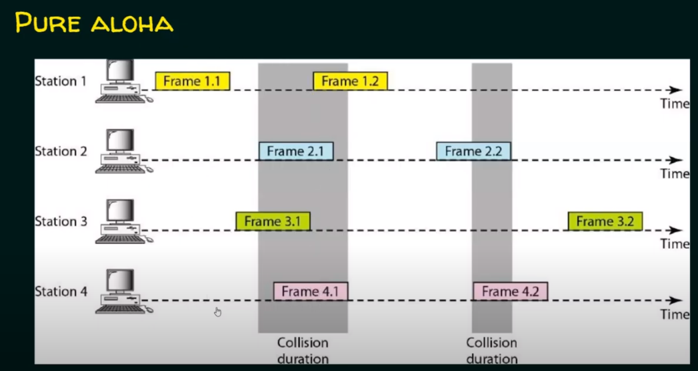

**Slotted ALOHA**

Logo depois que o ALOHA entrou em cena, Roberts(1972) publicou um método para duplicar a capacidade de um sistema ALOHA. Sua proposta era dividir o tempo em intervalos discretos, chamados **slots**, com cada intervalo correspondendo a um quadro. Esse método exige que os usuários concordem em relação às fronteiras dos slots. Uma forma de alcançar a sincronização entre os usuários seria ter uma estação especial que emitisse um sinal sonoro no início de cada intervalo, como um relógio.
Em contraste com o ALOHA original de Abramson, um computador não tem permissão para transmitir sempre que o usuário digita uma linha. Em vez disso, é necessário esperar o início do próximo slot. Consequentemente, o ALOHA original contínuo transforma-se em um sistema discreto. O período de vulnerabilidade está agora reduzido à metade.

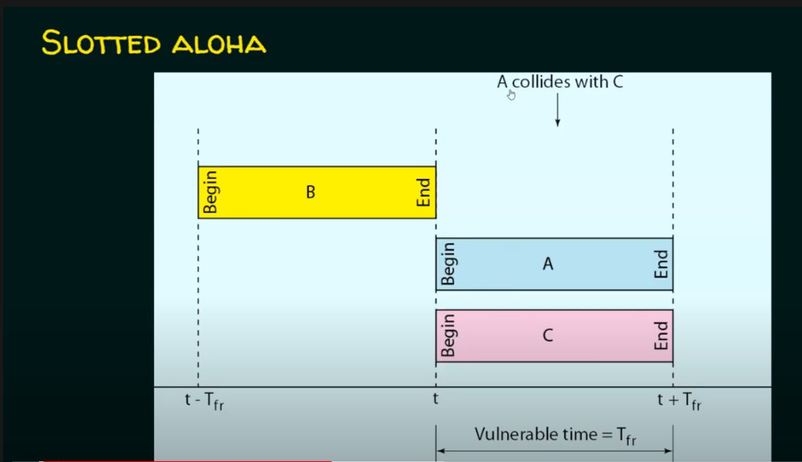

**Slotted ALOHA**

Vulnerable Time = Frame Transmission time.

Throughput = G x e^-G; Where G is the number of stations wish to transmit in the same time.

Maximum throughput = 0.368 for G=1.

O slotted ALOHA é importante por uma razão que, em princípio, talvez não seja óbvia. Ele foi criado na década de 70, foi usado em alguns sistemas experimentais e depois foi quase esquecido. Quando foi criado o acesso a Internet por cabo, surgiu o problema de como alocar um canal compartilhado entre vários usuários concorrentes, e o slotted ALOHA foi resgatado para salvar a situação.

## Curiosidades:
* ##### Napster
 foi o programa de compartilhamento de arquivos em rede P2P criado em 1999, que protagonizou o primeiro grande episódio na luta jurídica entre a indústria fonográfica e as redes de compartilhamento de música na internet.

* ##### Talk do UNIX
troca de mensagens instantâneas. Esses recurso, derivado do programa talk do UNIX, em uso desde aproximadamente 1970.

* ##### Comércio eletrônico
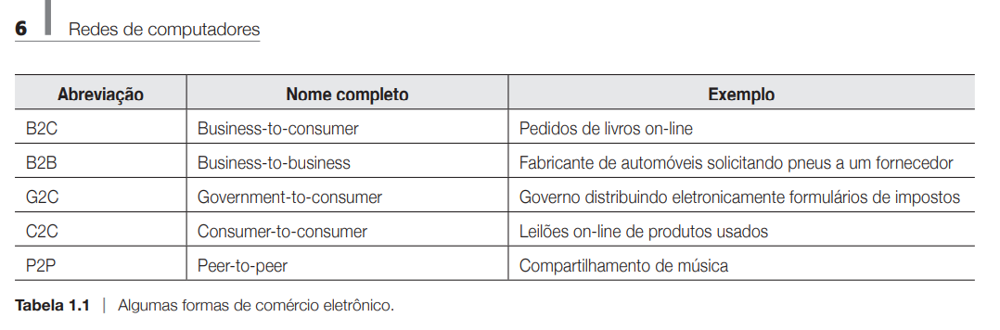

* #### DCS1000 (Carnivore)
Carnivore foi um sistema implementado pelo Federal Bureau of investigation - FBI, projetado para monitorar as comunicações de e-mail e eletrônicos. É utilizado um packet siniffer personalizável que pode monitorar todo o tráfego de um usuário da internet.

* #### Phishing
é o crime de enganar as pessoas para que compartilhem informações confidenciais como senhas e número de cartões de crédito. Como uma verdadeira pescaria, há mais de uma maneira fisgar uma vítima, mas uma tática de phishing é a mais comum.

* #### Ken Olsen
'Não há nenhuma razão para qualquer indivíduo ter um computador em casa'.

* A palavra **modem** é uma construção de 'modulador-demodulador' e refere-se a qualquer dispositivo que faz a conversão entre bits digitais e sinais analógicos.

* O acesso à Internet em velocidades muito maiores que as discadas é chamado de **banda larga (broadband).**
